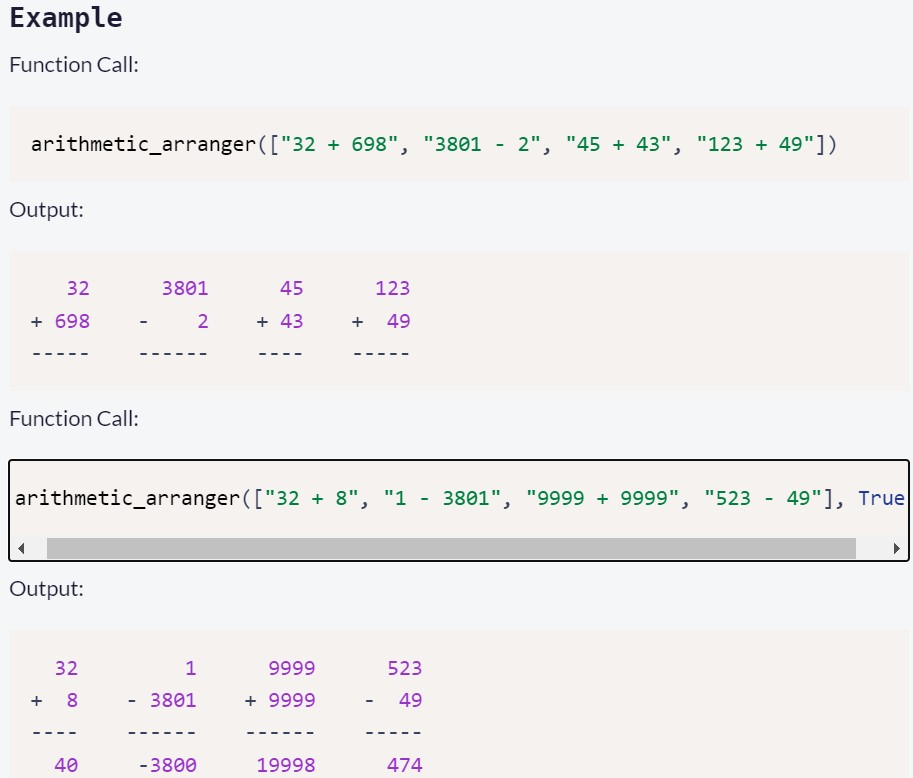

# Arithmetic Formatter
#### Solution running on : https://replit.com/@ViktoriusSuwand/Arithmetic-Formatter

This is the result to complete the Arithmetic Formatter project. 
Instructions for building this project can be found at 
https://www.freecodecamp.org/learn/scientific-computing-with-python/scientific-computing-with-python-projects/arithmetic-formatter

###  Some of additional features :
     * Using list comprehention to split the string
     * Using ternary operator to fix space between string
     * Using string adjutment to match format requirement
     * Using pytest to create online progress test
     * self tester function to do pre test

### Test Scenario :
1. The function will return the correct conversion if the supplied problems are properly formatted,
  otherwise, it will **return** a **string** that describes an error that is meaningful to the user.

2. Situations that will return an error:
  - If there are **too many problems** supplied to the function. The limit is **five**, anything more will return: `Error: Too many problems.`
  - The appropriate operators the function will accept are **addition** and **subtraction**. **Multiplication** and **division** will return an `error`. **Other** operators not mentioned in this bullet point will not need to be tested. The `error` returned will be: `Error: Operator must be '+' or '-'.`
  - Each **number** (operand) should only contain `digits`. Otherwise, the function will return: `Error: Numbers must only contain digits.`
  - Each **operand** (aka number on each side of the operator) has a max of **four** digits in `width`. Otherwise, the `error` string returned will be: `Error: Numbers cannot be more than four digits.`

3. If the user supplied the `correct format` of problems, the conversion you return will follow these rules:
  - There should be a `single space` between the `operator` and the `longest of the two operands`, `the operator` will be on the **same line** as the `second operand`, both `operands` will be in the **same order** as provided (`the first` will be the **top** one and `the second` will be the **bottom**).
  - `Numbers` should be `right-aligned`.
  - There should be `four spaces` between each `problem`.
  - There should be `dashes` at the **bottom** of each `problem`. The `dashes` should run along the `entire length` of each `problem` individually. (The example above shows what this should look like.)

 

### Development
Write your code in `arithmetic_arranger.py`. For development, you can use `main.py` to test your `arithmetic_arranger()` function. Click the "run" button and `main.py` will run.

### Testing
The unit tests for this project are in `test_module.py`. We are running the tests from `test_module.py` in `main.py` for your convenience. The tests will run automatically whenever you hit the "run" button. Alternatively you may run the tests by inputting `pytest` in the console

#### Test Result 
